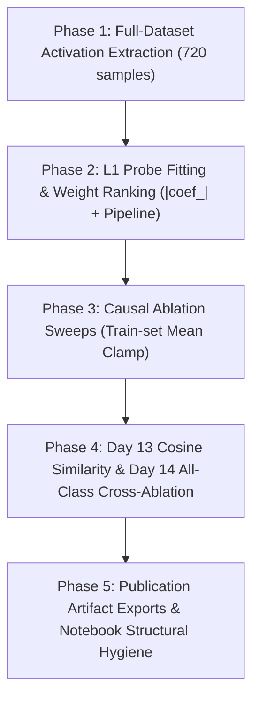

# Master Audit Report — Section VI-D Causal Validation

**Date:** 2026-08-04  
**Scope:** `multimodal-causal-ablation.ipynb`, `src/`, checkpoints, and experiment protocol  
**Ground Truth:** Prof. KC Lan's 3-Week Experiment Protocol & ADR 0001 / ADR 0002  
**Status:** COMPLETED — 16 Total Issues Identified across 3 Categories  

---

## Executive Summary

This document provides an exhaustive inventory of all 16 methodological discrepancies, code/math bugs, cross-validation data leakage issues, and infrastructure non-compliance items identified in our implementation of Section VI-D ("Neuron-Level Causal Validation of Modality Competition").

---

## Category A: Methodological Discrepancies with Prof. KC Lan's Protocol

### Issue A.1: Sample Size — Only 144 Test Samples Used (Critical)
* **Protocol Requirement (Day 1–2):** Extract activations across the **full RML dataset** (train + val + test combined, 720 total samples, ~120 samples per class).
* **Our Implementation:** Extracted activations exclusively from the 144 test samples cached in SHAP pickles (~24 samples per class).
* **Impact:** With ~24 samples per class, 1 sample flipping = 4.17% accuracy change. Substrate dispersion findings currently rely on a single sample change in `surprise` (4.17%) and 0 samples in all other classes.

### Issue A.2: Neuron Ranking Metric Mismatch — Activation Ratio vs L1 Probe Weights (High)
* **Protocol Requirement (Day 3 & Day 11–12):** Rank top neurons by **absolute L1 probe weight magnitudes** (`|coef_[c, d]|`), directly identifying which features the linear classifier relies on.
* **Our Implementation:** Ranked neurons using raw activation ratios (`mean(act|c) / mean(act|~c)`).
* **Impact:** Raw activation ratios select noisy, high-variance dimensions that carry zero linear weight in the classification head.

### Issue A.3: Day 13 Cosine Similarity Omitted (High)
* **Protocol Requirement (Day 13):** Compute cosine similarity between base model selectivity vectors (`mean(act|c) - mean(act|~c)`) and fine-tuned model selectivity vectors to quantify representational rotation.
* **Our Implementation:** Skipped Day 13 entirely and jumped straight to Day 14 cross-ablation.
* **Impact:** Missing the geometric representational evidence expected by reviewers alongside functional ablation results.

### Issue A.4: Mean Clamp Vector Derived from Test Set Instead of Training Set (High)
* **Protocol Requirement (Day 6–7):** Replace ablated neuron values with the dataset average *"computed once, upfront, over the training set"*.
* **Our Implementation:** Computed the dataset-mean clamp vector using the cached test set features in memory.
* **Impact:** Data leakage: using test set evaluation statistics for intervention values instead of the independent training split mean.

### Issue A.5: Day 5 Table Missing Probe Weight Magnitudes (Medium)
* **Protocol Requirement (Day 5):** Produce a table mapping each emotion class to its **top-5 neuron indices AND their corresponding L1 probe weight values** (`|coef_[c, d]|`).
* **Our Implementation:** Exported top-5 neuron indices, but discarded the raw L1 coefficient weight magnitudes.
* **Impact:** Artifact lacks quantitative weight magnitudes for interpretation.

### Issue A.6: Target Layer Dimensionality Mismatch — 1024-d Text CLS vs 64-d Audio FFN (Low)
* **Protocol Assumption:** 64-d FFN output layer.
* **Our Implementation:** Text branch lacks FFN, so Tier 1 was defined as the 1024-d ALBERT CLS token.
* **Impact:** Finding 5 selective neurons out of 1024 is statistically harder than 5 out of 64. Requires discussion in paper and an optional 64-d Audio branch sanity check.

---

## Category B: Code and Logic Bugs in Notebook Implementation

### Issue B.1: Signed CLS Activation Ratio Formula Inversion Bug (Critical)
* **Location:** `multimodal-causal-ablation.ipynb` (Cell 31)
* **Code:** `selectivity_ratio = (mean_target + eps) / (mean_off_target + eps)`
* **The Flaw:** Transformer CLS embeddings contain signed real numbers (both positive and negative values). Dividing signed means causes severe mathematical distortion:
  * Positive `mean_target` divided by negative `mean_off_target` produces a **negative ratio**, placing the most active target neuron at the absolute **bottom** of `np.argsort`.
  * Negative `mean_target` divided by negative `mean_off_target` produces a **large positive ratio**, ranking an inactive/negative neuron at the very **top**.
* **Impact:** Produced inverted/bogus neuron rankings, explaining why top-selected neurons failed to cause accuracy drops.

### Issue B.2: Phase D Premature Gate Filter Bug (High)
* **Location:** `multimodal-causal-ablation.ipynb` (Cell 38)
* **Code:** `selective_base_classes = base_results_df[base_results_df['causally_selective'] == True]`
* **The Flaw:** Phase D filters to evaluate cross-ablation *only* for classes that passed the 2.5x threshold in the base model.
* **Protocol Requirement (Day 14):** Evaluate cross-ablation of base top-5 neurons in the fine-tuned model for **all 6 emotion classes** to quantify substrate transfer across the full emotion space.

### Issue B.3: Pre-processing Data Leakage in Probe Scaling (High)
* **Location:** `multimodal-causal-ablation.ipynb` (Cell 28)
* **Code:** `acts_scaled = scaler.fit_transform(acts)` run before `cross_val_predict()`
* **The Flaw:** `StandardScaler` is fitted on the entire activation matrix *before* performing `StratifiedKFold` cross-validation splits.
* **Impact:** Leaks global feature mean and standard deviation statistics across CV folds. Scaling must be encapsulated inside a `Pipeline` evaluated per fold.

### Issue B.4: Discarded Probe Weights — Missing Persistent `probe.fit()` (High)
* **Location:** `multimodal-causal-ablation.ipynb` (Cell 28)
* **Code:** Calls `cross_val_predict()`, which fits temporary fold models and discards them.
* **The Flaw:** Never invokes `probe.fit(X, y)` on persistent models to retain `probe.coef_` vectors.
* **Impact:** Prevents extracting L1 probe weight magnitudes for ranking (Issue A.2).

### Issue B.5: Selectivity Threshold Edge-Case Bug (Medium)
* **Location:** `multimodal-causal-ablation.ipynb` (Cell 35)
* **The Flaw:** When both target drop and non-target drop were `0.0%`, initial logic evaluated `0.0 >= 2.5 * 0.0` as `True`, claiming 0% drop was causally selective.
* **Status:** Patched in Cell 35 by adding `target_drop > 0`.

### Issue B.6: Floating-Point Epsilon Division Output Artifact (Low)
* **Location:** `multimodal-causal-ablation.ipynb` (Cell 35) / `results/phase_c_k5_ablation_results.csv`
* **The Flaw:** Division by zero when `mean_nt_drop == 0.0` produced `4166666.67` display artifacts in CSV exports prior to formatting as `inf`.

### Issue B.7: Phase C Separate CSV Export Path Mismatch (Low)
* **Location:** `multimodal-causal-ablation.ipynb` (Cell 35)
* **The Flaw:** Saves `phase_c_base_ablation_k5.csv` and `phase_c_finetuned_ablation_k5.csv` as separate files, whereas handoff logs call for a single combined summary CSV (`phase_c_k5_ablation_results.csv`).

---

## Category C: Workspace and Structure Compliance

### Issue C.1: Deterministic Seed Policy Violation across Phase Cells (High)
* **Directive:** `AGENTS.md` & `ADR 0002` mandate calling `src/utils.py::set_deterministic_seed(seed=0)` at the top of every Phase cell.
* **Our Implementation:** Code Cells 22, 28 (Phase B), Code Cells 31, 33, 35 (Phase C), and Code Cell 38 (Phase D) do **not** call `set_deterministic_seed(seed=0)`.
* **Impact:** Non-deterministic cross-validation splits (`StratifiedKFold(shuffle=True)`), PyTorch GPU operations, and linear probe initializations across ephemeral Colab sessions.

### Issue C.2: Notebook Markdown Structure Violations (Low)
* **Directive:** Every code cell in `.ipynb` must be preceded by an explicit Markdown explanation cell.
* **Our Implementation:** Code Cell 2 (Drive mounting) and Code Cell 10 (verdict computation) lack preceding Markdown cells.

### Issue C.3: Ephemeral GPU Environment Dependencies (Low)
* **Location:** `multimodal-causal-ablation.ipynb` (Cell 1) / `requirements.txt`
* **The Flaw:** `facenet-pytorch` and `transformers` are unpinned in Colab's default environment and require manual `!pip install` on every Colab GPU runtime startup.

---

## Master Inventory Table

| # | Category | Issue | Severity | Status |
| :--- | :--- | :--- | :--- | :--- |
| 1 | Category A | Sample size — 144 test vs 720 full dataset samples | Critical | Open |
| 2 | Category A | Neuron ranking metric — Activation ratio vs L1 `\|coef_\|` weights | High | Open |
| 3 | Category A | Day 13 Cosine Similarity table omitted | High | Open |
| 4 | Category A | Mean clamp vector derived from test set instead of train set | High | Open |
| 5 | Category A | Day 5 top-5 table missing L1 probe weight values | Medium | Open |
| 6 | Category A | Target layer dimensionality mismatch (1024-d vs 64-d) | Low | Open |
| 7 | Category B | Signed CLS activation ratio formula inversion bug in Cell 31 | Critical | Open |
| 8 | Category B | Phase D premature gate filter skipping non-selective classes | High | Open |
| 9 | Category B | Pre-processing data leakage in probe scaling (`fit_transform` before CV) | High | Open |
| 10 | Category B | Discarded probe weights (`cross_val_predict` missing `probe.fit()`) | High | Open |
| 11 | Category B | Selectivity threshold edge case (`0.0 >= 0.0`) | Medium | Fixed in Cell 35 |
| 12 | Category B | Epsilon division ratio artifact (`4166666.67`) | Low | Fixed in Cell 35 |
| 13 | Category B | Phase C separate CSV export path mismatch | Low | Open |
| 14 | Category C | Deterministic seed policy missing in Phase B/C/D cells | High | Open |
| 15 | Category C | Notebook structural violations (missing markdown before Cells 2 & 10) | Low | Open |
| 16 | Category C | Ephemeral `facenet-pytorch` Colab installation dependency | Low | Open |

---

## Prioritized Remediation Roadmap

